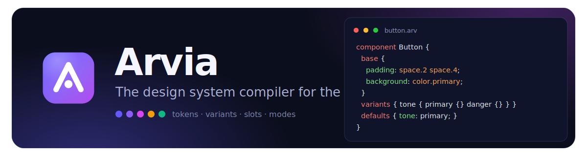

<p align="center">
  
</p>

# Arvia

**A framework-agnostic design system compiler.**

Write `.arv` files — themes, tokens, recipes, components — and compile them to optimized CSS and typed TypeScript APIs. Zero runtime styling cost.

```tsx
import { Button } from "./button.arv";

const styles = Button({ size: "lg", tone: "danger" });
<button className={styles.root}>Delete</button>;
```

```arv
component Button {
  variants {
    size { sm {} lg {} }
    tone { primary { background: color.primary; } danger { background: color.danger; } }
  }
  defaults { size: sm; tone: primary; }
}
```

## Documentation

The full language reference, tooling guides, and interactive playground live in the docs site:

```bash
pnpm install
pnpm website
```

Then open [localhost:5173](http://localhost:5173) — start at **Docs → Introduction** or try the **Playground**.

## Install

Arvia is framework-agnostic: the compiler emits plain CSS and dependency-free JavaScript, so anything that renders a `class` attribute can consume it. Framework-specific Vite entrypoints bundle the plugin, CLI, and TypeScript setup:

### React

```bash
npm install -D @arviahq/vite-plugin-react
```

```ts
// vite.config.ts
import { defineConfig } from "vite";
import react from "@vitejs/plugin-react";
import { arvia } from "@arviahq/vite-plugin-react";

export default defineConfig({
  plugins: [arvia({ theme: "src/theme.arv" }), react()],
});
```

### Preact

```bash
npm install -D @arviahq/vite-plugin-preact @preact/preset-vite preact
```

```ts
// vite.config.ts
import { defineConfig } from "vite";
import preact from "@preact/preset-vite";
import { arvia } from "@arviahq/vite-plugin-preact";

export default defineConfig({
  plugins: [arvia({ theme: "src/theme.arv" }), preact()],
});
```

### Vue

```bash
npm install -D @arviahq/vite-plugin-vue @vitejs/plugin-vue vue
```

```ts
// vite.config.ts
import { defineConfig } from "vite";
import vue from "@vitejs/plugin-vue";
import { arvia } from "@arviahq/vite-plugin-vue";

export default defineConfig({
  plugins: [arvia({ theme: "src/theme.arv" }), vue()],
});
```

The `arvia-tsc` shipped by this package is Vue-aware — it loads the Vue language plugin alongside Arvia's, so `.arv` imports inside `.vue` single-file components typecheck. Use it in place of `vue-tsc`.

### Other frameworks

`@arviahq/vite-plugin` is the framework-agnostic core the entrypoints above re-export — pair it with any Vite setup (Svelte, Solid, Lit, server-rendered templates).

See **Docs → Quick start** in the site for the full setup.

## Editor support

- **VS Code** — syntax highlighting, diagnostics, completion, hover, and formatting. The packaged extension ships in this repo at [`packages/vscode-extension/arvia.vsix`](./packages/vscode-extension/arvia.vsix):

  ```bash
  code --install-extension packages/vscode-extension/arvia.vsix
  ```

  Or in VS Code: **Extensions → ⋯ → Install from VSIX…** Works in Cursor and other VS Code forks too.

- **Zed** — install the Arvia extension from [`packages/zed-extension`](./packages/zed-extension).
- **Neovim & others** — tree-sitter grammar in [`packages/tree-sitter-arvia`](./packages/tree-sitter-arvia), plus `@arviahq/language-server` for any LSP client.

## Packages

| Package                                                  | Install? | Purpose                                                    |
| -------------------------------------------------------- | -------- | ---------------------------------------------------------- |
| `@arviahq/vite-plugin-react`                             | **yes**  | React + Vite entrypoint (plugin, CLI, TypeScript)          |
| `@arviahq/vite-plugin-preact`                            | **yes**  | Preact + Vite entrypoint (plugin, CLI, TypeScript)         |
| `@arviahq/vite-plugin-vue`                               | **yes**  | Vue + Vite entrypoint (plugin, CLI, Vue-aware `arvia-tsc`) |
| `@arviahq/vite-plugin`                                   | agnostic | Framework-agnostic Vite plugin + `arvia` CLI               |
| `@arviahq/typescript-plugin`                             |          | tsserver plugin + `arvia-tsc` for typed `.arv` props       |
| `@arviahq/compiler`                                      |          | Core compiler                                              |
| `@arviahq/language-server`                               |          | LSP for `.arv` files                                       |
| `@arviahq/storybook`                                     |          | Storybook story generator                                  |
| `@arviahq/docs`                                          |          | Token catalog generator                                    |
| [`arvia` VS Code extension](./packages/vscode-extension) | vsix     | Syntax highlighting, diagnostics, completion, hover        |

## Development

```bash
pnpm install
pnpm build
pnpm test
```

Contributors: [`examples/demo`](./examples/demo) for a local playground, [`PUBLISHING.md`](./PUBLISHING.md) for releases.

## License

MIT
